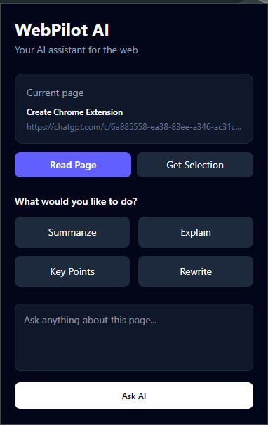
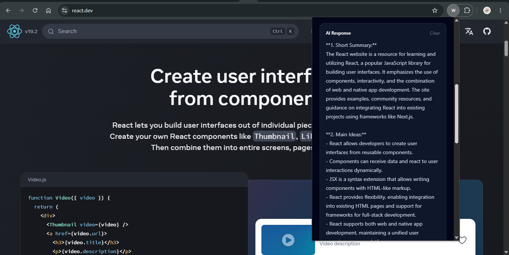
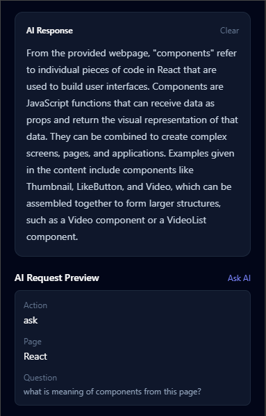

# WebPilot AI

> An AI-powered Chrome extension that understands webpage content and provides contextual assistance directly from the browser.

## Overview

WebPilot AI is a full-stack Chrome extension that allows users to interact with webpage content using AI.

Instead of copying webpage content into an external AI chatbot, users can open WebPilot AI directly from Chrome and ask the AI to summarize, explain, rewrite, extract key points, or answer questions based on the current webpage.

## Features

- 📄 Read and analyze webpage content
- 📝 Generate AI-powered summaries
- 💡 Explain complex content in simple terms
- 🔑 Extract important key points
- ✍️ Rewrite selected content
- 💬 Ask contextual questions about the current webpage
- ⚡ Chrome Manifest V3 extension
- 🔐 Server-side AI API key management
- 🌐 Node.js/Express REST API
- 🤖 OpenRouter LLM integration

---

## Demo

### Main Interface



### AI Summarization



### Ask AI



### Demo Video


---

## Architecture

```text
┌─────────────────────────┐
│     Chrome Extension    │
│                         │
│       React Popup       │
└────────────┬────────────┘
             │
             │ Chrome Messaging
             ▼
┌─────────────────────────┐
│     Content Script      │
│                         │
│    Webpage Content      │
└────────────┬────────────┘
             │
             │ HTTPS
             ▼
┌─────────────────────────┐
│    Node.js + Express    │
│        REST API         │
└────────────┬────────────┘
             │
             │ API Request
             ▼
┌─────────────────────────┐
│       OpenRouter        │
│                         │
│      LLM Provider       │
└────────────┬────────────┘
             │
             ▼
        AI Response
             │
             ▼
       Chrome Extension
```

## Tech Stack

### Frontend
- React
- JavaScript
- Tailwind CSS
- Chrome Extension APIs
- Chrome Manifest V3

### Backend
- Node.js
- Express.js
- REST API
- CORS
- dotenv

### AI
- OpenRouter
- Large Language Models (LLMs)
- Prompt Engineering

### Deployment & Tools
- Render
- GitHub
- npm

## Project Structure

```text
webpilot-ai/
│
├── extension/
│   ├── public/
│   │   ├── manifest.json
│   │   └── content.js
│   │
│   └── src/
│       ├── components/
│       ├── constants/
│       ├── services/
│       ├── utils/
│       ├── App.jsx
│       ├── main.jsx
│       └── index.css
│
├── server/
│   └── src/
│       ├── controllers/
│       ├── routes/
│       ├── services/
│       └── server.js
│
├── screenshots/
│
├── .gitignore
├── LICENSE
└── README.md
```

## How It Works

1. The user opens a webpage in Chrome.
2. WebPilot AI uses a Chrome content script to read the webpage content.
3. The React popup creates an AI request containing the webpage context.
4. The request is sent to the Node.js/Express backend.
5. The backend sends the request to OpenRouter.
6. The selected LLM processes the webpage context.
7. The AI response is returned to the backend.
8. The backend sends the result back to the Chrome extension.
9. The result is displayed inside the React popup.

## Getting Started

### Prerequisites

Make sure you have:

- Node.js
- npm
- Google Chrome
- An OpenRouter API key

### 1. Clone the Repository

```bash
git clone https://github.com/AshimKr/webpilot-ai.git
cd webpilot-ai
```

### 2. Configure the Backend

Navigate to the server:

```bash
cd server
```

Install dependencies:

```bash
npm install
```

Create a `.env` file:

```
PORT=5000
OPENROUTER_API_KEY=your_openrouter_api_key
OPENROUTER_MODEL=your_openrouter_model
```

> ⚠️ Never commit your `.env` file or expose your OpenRouter API key in the Chrome extension.

### 3. Start the Backend

```bash
npm start
```

The server should start on:

```
http://localhost:5000
```

You can verify it by opening:

```
http://localhost:5000/health
```

Expected response:

```json
{
  "success": true,
  "status": "healthy"
}
```

### 4. Build the Chrome Extension

Open another terminal:

```bash
cd extension
```

Install dependencies:

```bash
npm install
```

Build the extension:

```bash
npm run build
```

### 5. Load the Extension in Chrome

> **Note:** WebPilot AI is not currently published on the Chrome Web Store. It must be loaded manually using Chrome's Developer Mode, as described below.

Open:

```
chrome://extensions
```

Then:

1. Enable **Developer mode**.
2. Click **Load unpacked**.
3. Select the generated `extension/dist` directory.
4. Open a webpage.
5. Open WebPilot AI from the Chrome extensions menu.
6. Click **Read Current Page**.
7. Try one of the AI actions.

## API

`POST /api/ai`

The extension sends webpage context to the backend through this endpoint.

### Example Request

```json
{
  "action": "summarize",
  "page": {
    "title": "Example Page",
    "url": "https://example.com",
    "content": "Page content..."
  },
  "selectedText": "",
  "userQuestion": ""
}
```

### Example Response

```json
{
  "success": true,
  "action": "summarize",
  "result": "..."
}
```

### Supported Actions

| Action       | Description                                  |
|--------------|-----------------------------------------------|
| `summarize`  | Generates a concise summary of the webpage    |
| `explain`    | Explains webpage or selected content          |
| `key-points` | Extracts important points                     |
| `rewrite`    | Rewrites selected content                      |
| `ask`        | Answers questions using webpage context        |

## Security

The OpenRouter API key is never exposed to the Chrome extension.

The architecture separates the public extension from the private AI credentials:

```text
Chrome Extension
       │
       │ No API key
       ▼
Node.js Backend
       │
       │ Secure API key
       ▼
OpenRouter
```

The API key is stored as a server-side environment variable:

```
OPENROUTER_API_KEY
```

and should never be committed to GitHub.

## Deployment

The backend is designed to be deployed as a Node.js web service.

Current deployment architecture:

```text
Chrome Extension
       │
       │ HTTPS
       ▼
Render
       │
       │ REST API
       ▼
Node.js + Express
       │
       ▼
OpenRouter
```

**Deployed backend URL:** _TODO — add once finalized_

### Backend

The backend can be deployed using Render or another Node.js-compatible hosting provider.

### Extension

The extension can currently be installed locally through Chrome Developer Mode.

A Chrome Web Store release can be added in a future version.

## Future Improvements

Planned improvements include:

- Structured AI responses
- Streaming AI responses
- Improved webpage content extraction
- Conversation history
- Multiple AI model selection
- Response caching
- Token/context optimization
- User preferences
- Authentication
- Chrome Web Store release

## Learning & Technical Highlights

This project demonstrates practical experience with:

- React state management
- Chrome Extension Manifest V3
- Chrome content scripts
- Browser-to-extension messaging
- REST API design
- Node.js and Express
- Environment variable management
- LLM API integration
- Prompt engineering
- Full-stack application architecture
- Frontend/backend communication

## License

This project is licensed under the MIT License. See the [LICENSE](LICENSE) file for details.

## Author

**Ashim Kr**

GitHub: [https://github.com/AshimKr](https://github.com/AshimKr)